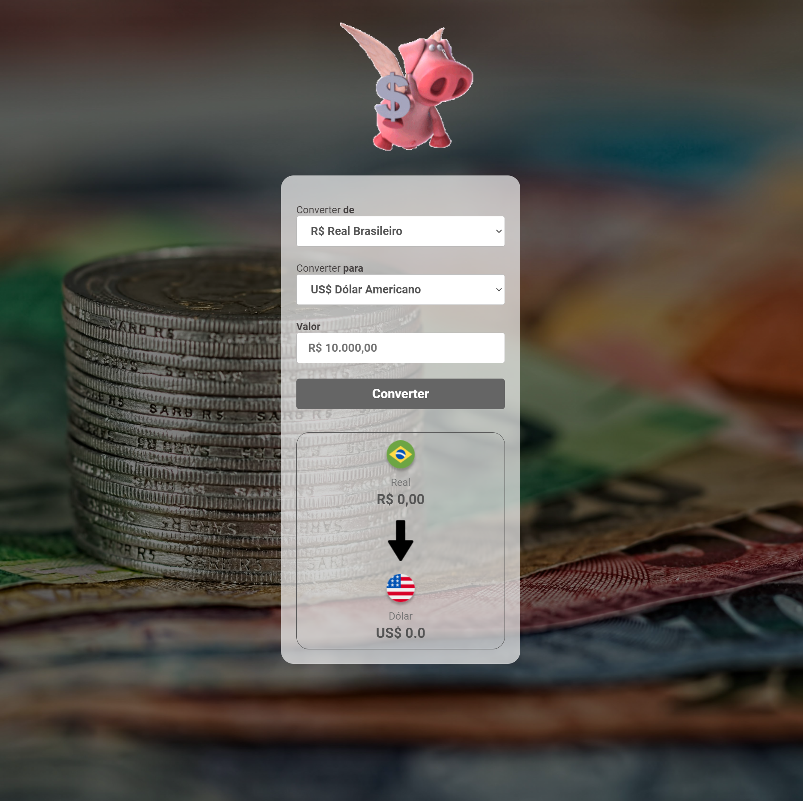

# Desafio Javascript: Criando um Conversor de Moedas

Bem vindo(a) ao desafio do módulo de JavaScript-WEB da Trilha FullStack-PRO do DevClub! Nele, foi proposto a criação de um Conversor de Moedas funcional utilizando principalmente fundamentos de Javascript, colocando em prática as propriedades básicas dessa linguagem de programação.

[Clique aqui](https://laribg.github.io/Conversor-de-Moedas/) para acessar o resultado final do desafio proposto.

Na sequência segue o modelo proposto pelo professor Rodolfo Mori [Link do Figma](https://www.figma.com/file/9JDIdFDjYDVL5VGzw8Mc4b/DevClub---Convert-Money?type=design&node-id=25-104&mode=design&t=KbC5WQibHlKpQDMS-0) contendo o protótipo do desafio para que você possa se basear.
